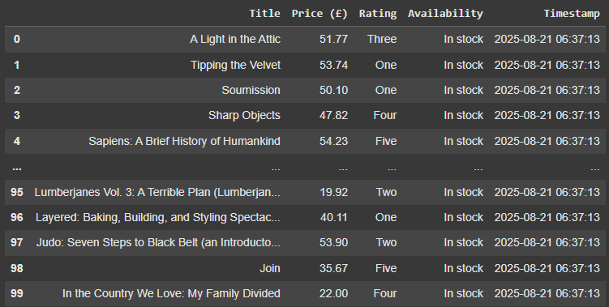
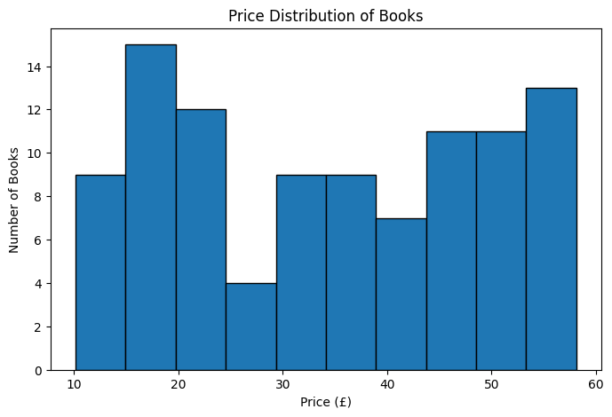

# Bookstore Web Scraping Project

## 📌 Overview
This is my first data project where I practiced **Web Scraping and Data Analysis** using Python.  
I scraped product data (name, price, availability) from an online bookstore for learning purposes.

---

## 🔧 Tools & Libraries
- **Requests & BeautifulSoup** → for web scraping  
- **Pandas** → for data cleaning and storing in Excel  
- **Matplotlib** → for data visualization  

---

## 📊 What I Did
- Scraped book data across multiple pages  
- Saved the data into a structured **Excel file**  
- Created simple visualizations (e.g., price distribution, availability)  

---

## 📸 Results
Here are some outputs from the project:

### Example Data

### Price Distribution

---

## 🚀 Key Learning
This project helped me understand:
- How to extract real-world data from websites  
- How to organize raw data into structured formats  
- How to create basic visualizations to get insights  

---

## 📂 Files in this Repository
- `bookstore_scraper.ipynb` → Jupyter/Colab Notebook with the full code  
- `bookstore_scraper.py` → Python script version  
- `books_data.xlsx` → Exported Excel file with the scraped data  
- `README.md` → Project documentation  
